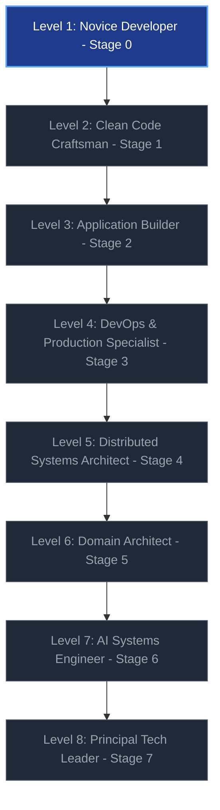
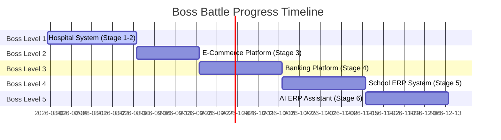

# Learner Progress & Gamified Growth Tracker

Welcome to your personal growth dashboard! Use this file to track your task completions, monitor your skill progression across all 8 stages, and level up your software engineering mastery.

---

## 📊 Skill Growth Map & Milestone Levels

---

## 📈 Stage Completion & XP Scorecard

| Stage | Stage Title | Total Tasks | XP Available | Status |
| :--- | :--- | :---: | :---: | :---: |
| **Stage 0** | Prerequisites | 6 Tasks | 100 XP | Completed |
| **Stage 1** | Think Like an Engineer | 6 Tasks | 150 XP | In Progress |
| **Stage 2** | Write Maintainable Software | 8 Tasks | 200 XP | Locked |
| **Stage 3** | Build Production Software | 8 Tasks | 250 XP | Locked |
| **Stage 4** | Design Large Systems | 10 Tasks | 300 XP | Locked |
| **Stage 5** | Software Architecture | 10 Tasks | 350 XP | Locked |
| **Stage 6** | AI Native Engineer | 10 Tasks | 400 XP | Locked |
| **Stage 7** | Principal Mindset | 6 Tasks | 250 XP | Locked |
| **Total** | **Full Roadmap** | **64 Tasks** | **2,000 XP** | **Level 1** |

---

## 🎯 Detailed Task Checklists

Mark your progress by changing `[ ]` to `[x]` as you complete each weekly task!

### Stage 0: Prerequisites (100 XP)

- [x] **Stage 0 / Week 1 / Task 1:** Create a class with 3 properties and 1 method (20 XP)
- [x] **Stage 0 / Week 1 / Task 2:** Instantiate 2 objects and call object methods (20 XP)
- [x] **Stage 0 / Week 1 / Task 3:** Execute SELECT, INSERT, UPDATE, DELETE SQL queries (20 XP)
- [x] **Stage 0 / Week 2 / Task 1:** Make a GET request to a public API via Postman/Browser (15 XP)
- [x] **Stage 0 / Week 2 / Task 2:** Commit 2 changes and push to a remote GitHub repository (15 XP)
- [x] **Stage 0 / Week 2 / Task 3:** Read a stack trace and fix an intentional crash using logs (10 XP)

---

### Stage 1: Think Like an Engineer (150 XP)

- [ ] **Stage 1 / Week 1 / Task 1:** Rename 5 vague variables into descriptive names in existing code (25 XP)
- [ ] **Stage 1 / Week 1 / Task 2:** Refactor a 40+ line function into 2-3 small helper functions (25 XP)
- [ ] **Stage 1 / Week 1 / Task 3:** Add structured logging to record function start, success, and failure (25 XP)
- [ ] **Stage 1 / Week 2 / Task 1:** Refactor a class to enforce Single Responsibility Principle (25 XP)
- [ ] **Stage 1 / Week 2 / Task 2:** Create an interface (e.g., `IEmailService`) for decoupled design (25 XP)
- [ ] **Stage 1 / Week 2 / Task 3:** Write your first unit test using the Arrange-Act-Assert pattern (25 XP)

---

### Stage 2: Write Maintainable Software (200 XP)

- [ ] **Stage 2 / Task 1:** Implement Factory & Repository patterns in an application (40 XP)
- [ ] **Stage 2 / Task 2:** Configure Dependency Injection container for services (40 XP)
- [ ] **Stage 2 / Task 3:** Build user login & authorization middleware (40 XP)
- [ ] **Stage 2 / Task 4:** Add request payload validation rules (40 XP)
- [ ] **Stage 2 / Task 5:** Complete Mini Project: Library Management System (40 XP)

---

### Stage 3: Build Production Software (250 XP)

- [ ] **Stage 3 / Task 1:** Containerize a full-stack app using Docker & Docker Compose (50 XP)
- [ ] **Stage 3 / Task 2:** Set up GitHub Actions CI/CD workflow for automated testing (50 XP)
- [ ] **Stage 3 / Task 3:** Integrate Redis caching for fast API responses (50 XP)
- [ ] **Stage 3 / Task 4:** Build background worker queue for async tasks (50 XP)
- [ ] **Stage 3 / Task 5:** Complete Mini Project: E-Commerce Backend (50 XP)

---

### Stage 4: Design Large Systems (300 XP)

- [ ] **Stage 4 / Task 1:** Design load balancing & database read-replica setup (60 XP)
- [ ] **Stage 4 / Task 2:** Implement message streaming with Apache Kafka / RabbitMQ (60 XP)
- [ ] **Stage 4 / Task 3:** Design event-driven architecture for order processing (60 XP)
- [ ] **Stage 4 / Task 4:** Complete Mini Project: Online Banking Platform (120 XP)

---

### Stage 5: Software Architecture & DDD (350 XP)

- [ ] **Stage 5 / Task 1:** Map domain aggregates & bounded contexts for a business domain (70 XP)
- [ ] **Stage 5 / Task 2:** Implement Clean Architecture project structure (70 XP)
- [ ] **Stage 5 / Task 3:** Implement CQRS pattern separating command and query pipelines (70 XP)
- [ ] **Stage 5 / Task 4:** Write Architecture Decision Records (ADRs) for major design trade-offs (70 XP)
- [ ] **Stage 5 / Task 5:** Complete Mini Project: School ERP System (70 XP)

---

### Stage 6: AI Native Software Engineer (400 XP)

- [ ] **Stage 6 / Task 1:** Integrate LLM APIs with custom prompt templates & context windows (80 XP)
- [ ] **Stage 6 / Task 2:** Build a Model Context Protocol (MCP) server for tool execution (80 XP)
- [ ] **Stage 6 / Task 3:** Build a Retrieval-Augmented Generation (RAG) pipeline with vector DB (80 XP)
- [ ] **Stage 6 / Task 4:** Build multi-agent workflow loop for complex problem solving (80 XP)
- [ ] **Stage 6 / Task 5:** Complete Mini Project: AI ERP Assistant (80 XP)

---

### Stage 7: Principal Engineer Mindset (250 XP)

- [ ] **Stage 7 / Task 1:** Write a System Requirements Specification (PRD) from raw business goals (60 XP)
- [ ] **Stage 7 / Task 2:** Conduct architectural trade-off evaluation & cost estimation (60 XP)
- [ ] **Stage 7 / Task 3:** Complete Enterprise Platform Architecture Design (130 XP)

---

## 🏆 Boss Defeat Tracker

- [ ] **Boss 1 Defeated:** Hospital Management System
- [ ] **Boss 2 Defeated:** E-Commerce Platform
- [ ] **Boss 3 Defeated:** Banking Platform
- [ ] **Boss 4 Defeated:** School ERP System
- [ ] **Boss 5 Defeated:** AI ERP Assistant

---

## 🏅 Badges & Unlocks

- 🛡️ **Clean Coder:** Complete Stage 1 (Clean Code & SOLID)
- ⚙️ **Production Ready:** Complete Stage 3 (Docker, Redis, CI/CD)
- 🏛️ **Master Architect:** Complete Stage 5 (DDD & Clean Architecture)
- 🤖 **AI System Pioneer:** Complete Stage 6 (MCP, RAG & Agents)
- 👑 **Principal Engineer:** Complete All 7 Stages
