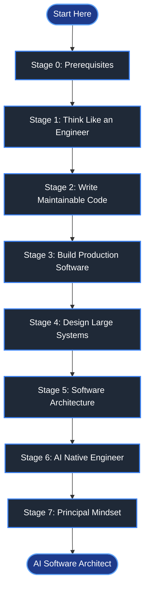
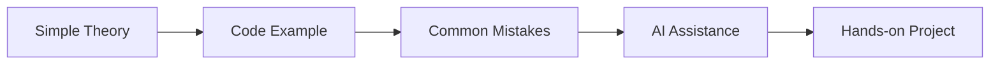
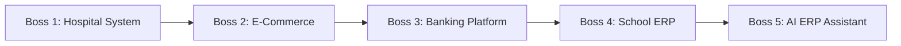
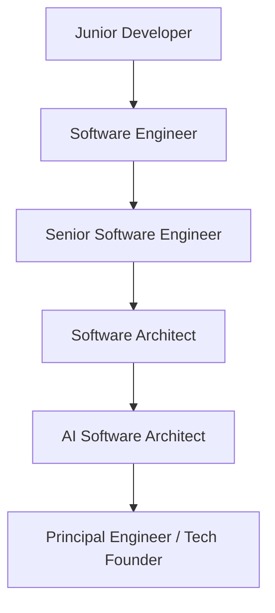

# AI Software Engineer Roadmap
> **From Developer to AI Software Architect — Simple, Practical, and Accessible to Everyone.**

---

## A Note Before You Start

> **Struggling with DSA, LeetCode, or complex math? You are not alone.**
> 
> Many great software engineers are not competitive programmers. In the AI era, software engineering is shifting from memorizing algorithms to **building systems**, **understanding software design**, and **collaborating with AI**.
> 
> If you know basic programming, you can master this roadmap. No heavy DSA required.
> 
> **Interactive Dashboard:** Track your tasks, XP points, and unlocked badges in [PROGRESS.md](PROGRESS.md).

---

## Learning Path Overview

---

## Modular Navigation & 24-Week Timeline

> **Already experienced in earlier stages?**  
> You do not have to start from Stage 0. Jump directly to any stage matching your goals. Each stage contains weekly guides, step-by-step tasks, and hands-on projects.

| Stage | Stage Name | Recommended Time | Core Weekly Focus | Docs & Guides |
| :--- | :--- | :--- | :--- | :--- |
| **Stage 0** | Prerequisites | 2 Weeks | Core Programming, SQL, REST APIs, Git & Debugging | [Week 1](docs/stage-0-prerequisites/week-1-programming-oop-and-sql.md) \| [Week 2](docs/stage-0-prerequisites/week-2-git-apis-and-debugging.md) |
| **Stage 1** | Think Like an Engineer | 2 Weeks | Clean Code, Naming, SOLID & Unit Testing | [Week 1](docs/stage-1-think-like-an-engineer/week-1-clean-code-and-naming.md) \| [Week 2](docs/stage-1-think-like-an-engineer/week-2-solid-and-testing.md) |
| **Stage 2** | Write Maintainable Software | 3 Weeks | Design Patterns, Dependency Injection, Auth & Validation | [Stage 2 Guides](docs/stage-2-write-maintainable-software/) |
| **Stage 3** | Build Production Software | 3 Weeks | Docker, CI/CD Pipelines, Redis Caching & Queues | [Stage 3 Guides](docs/stage-3-build-production-software/) |
| **Stage 4** | Design Large Systems | 4 Weeks | System Design, Load Balancing, Database Scaling & Kafka | [Stage 4 Guides](docs/stage-4-design-large-systems/) |
| **Stage 5** | Software Architecture | 4 Weeks | Clean Architecture, Domain-Driven Design (DDD) & CQRS | [Stage 5 Guides](docs/stage-5-software-architecture/) |
| **Stage 6** | AI Native Engineer | 4 Weeks | LLMs, MCP Protocol, RAG Pipelines & AI Agents | [Stage 6 Guides](docs/stage-6-ai-native-engineer/) |
| **Stage 7** | Principal Engineer Mindset | 2 Weeks | Requirements Engineering, Tech Strategy & Leadership | [Stage 7 Guides](docs/stage-7-principal-mindset/) |

---

## Stage 0 — Prerequisites

### Goal
Feel confident writing basic code independently.

### Documentation & Weekly Guides
- [Week 1: Programming Foundations, OOP & SQL](docs/stage-0-prerequisites/week-1-programming-oop-and-sql.md)
- [Week 2: REST APIs, Git & Debugging](docs/stage-0-prerequisites/week-2-git-apis-and-debugging.md)

### Core Topics
- Basic Programming (C#, Python, JavaScript, or any language you like)
- Object-Oriented Concepts (Classes, Objects, Methods)
- Basic SQL (SELECT, INSERT, UPDATE, DELETE)
- REST APIs (GET, POST, PUT, DELETE)
- Basic Git commands (`git clone`, `commit`, `push`)
- Simple Debugging (Finding and fixing code errors)

### Your Outcome
> "I can build basic apps independently without feeling stuck."

---

## Stage 1 — Think Like an Engineer

### Goal
Write clean, readable code that any team member can easily understand.

### Documentation & Weekly Guides
- [Week 1: Clean Code & Meaningful Naming](docs/stage-1-think-like-an-engineer/week-1-clean-code-and-naming.md)
- [Week 2: SOLID Principles & Unit Testing](docs/stage-1-think-like-an-engineer/week-2-solid-and-testing.md)

### Core Topics
- Clean Code basics (good variable names, small functions)
- SOLID Principles made simple
- Basic Refactoring (cleaning up messy code)
- Easy Error Handling & Logging (tracking bugs easily)
- Simple Unit Testing (checking if your function works)

### Your Outcome
> "I write clean code that other developers enjoy working on."

---

## Stage 2 — Write Maintainable Software

### Goal
Learn how software is built in real company projects.

### Core Topics
- Popular Design Patterns (Factory, Repository, Dependency Injection)
- Building Clean REST APIs
- User Login & Security (Authentication & Authorization)
- Form & Data Validation
- Simple Git Workflows (Feature branches and Pull Requests)

### Mini Project
**Library Management System**

### Your Outcome
> "I can build production-ready applications with team best practices."

---

## Stage 3 — Build Production Software

### Goal
Learn how applications run in the real world outside your local machine.

### Core Topics
- Docker Basics (putting apps in containers)
- Simple CI/CD Pipelines (automated deployments)
- Caching with Redis (making apps faster)
- Background Tasks & Job Queues
- App Monitoring & Error Alerting
- Production Security Basics

### Mini Project
**E-Commerce Backend**

### Your Outcome
> "I can deploy, run, and monitor real apps in production."

---

## Stage 4 — Design Large Systems

### Goal
Understand how apps handle millions of users and scale effortlessly.

### Core Topics
- System Design Basics (Load Balancing, Caching, Databases)
- SQL vs NoSQL — choosing the right database
- Microservices vs Monoliths
- Message Queues (Kafka / RabbitMQ made simple)
- Event-Driven Design (apps reacting to user actions)

### Mini Project
**Online Banking Platform**

### Your Outcome
> "I understand how big systems scale and talk to each other."

---

## Stage 5 — Software Architecture

### Goal
Plan and structure big software projects before writing code.

### Core Topics
- Clean Architecture (keeping business rules separate from frameworks)
- Domain-Driven Design (DDD) — structuring code around business terms
- CQRS (separating read actions from write actions)
- Architectural Decision Records (ADRs) — tracking design choices
- Balancing trade-offs (speed vs complexity)

### Mini Project
**School ERP System**

### Your Outcome
> "I can design application architectures like a Software Architect."

---

## Stage 6 — AI Native Software Engineer

### Goal
Use AI as a super-powered coding partner to build faster and smarter.

### Core Topics
- Working with LLM APIs (OpenAI, Claude, Groq)
- Prompt Engineering & Context Management
- Model Context Protocol (MCP) — connecting AI to your code & tools
- RAG (Retrieval-Augmented Generation) — letting AI search your documents
- AI Agents & Multi-Agent Workflows
- AI Code Reviews & Observability

### Mini Project
**AI ERP Assistant**

### Your Outcome
> "I build software with AI as a multiplier, not a replacement."

---

## Stage 7 — Principal Engineer Mindset

### Goal
Solve business problems, guide teams, and lead technical strategy.

### Core Topics
- Translating Business Requirements into Tech Specs
- Product Thinking & User Focus
- Technical Leadership & Team Mentorship
- Architectural Documentation & Clear Communication
- Estimating effort and managing project trade-offs

### Mini Project
**Enterprise Platform Design**

### Your Outcome
> "I can lead technical decisions and solve real business challenges."

---

## Simple Stage Checklist

Every topic module includes:

- **Simple Explanation** — No complex academic jargon.
- **Real World Use Case** — Practical examples from everyday apps.
- **Code Example** — Short, easy-to-read snippet.
- **Mistakes to Avoid** — Common pitfalls explained simply.
- **AI Tip** — How AI can help you learn or implement this topic.
- **Hands-on Practice** — A small, doable exercise.

---

## Boss Level Projects

1. **Hospital Management System** — Clean Code, REST APIs, Auth, Unit Testing.
2. **E-Commerce Platform** — Docker, Redis Caching, Queues, CI/CD.
3. **Banking Platform** — System Design, Event-Driven Architecture, Kafka.
4. **School ERP System** — Clean Architecture, Domain-Driven Design (DDD), CQRS.
5. **AI Powered ERP Assistant** — LLMs, MCP, RAG, AI Agents, Tool Calling.

---

## Career Growth Ladder

> **Learn Engineering.**  
> **Learn Architecture.**  
> **Use AI to multiply your growth.**
