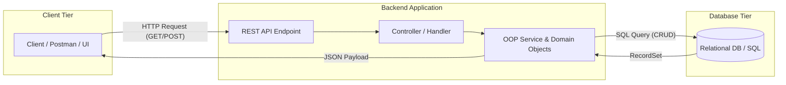

# Stage 0 Cheat Sheet — Prerequisites & Foundations

A high-density reference guide covering Object-Oriented Programming (OOP), SQL, REST APIs, Git workflows, and systematic debugging strategies.

---

## 1. Programming & OOP Core

### Key Concepts

| Term | Definition | Real-World Analogy |
| :--- | :--- | :--- |
| **Class** | User-defined data type; blueprint for objects | Architectural blueprint of a building |
| **Object** | Concrete instance of a class occupying memory | Physical building constructed from blueprint |
| **Property** | Variable defined inside a class representing state | Building address, color, number of floors |
| **Method** | Function defined inside a class representing behavior | `UnlockDoor()`, `TurnOnElevator()` |
| **Encapsulation** | Bundling data and methods while restricting access | Hidden electrical wiring controlled by a light switch |

### OOP Code Snippet (C# & Python)

```csharp
// C# Example
public class BankAccount
{
    public string AccountNumber { get; private set; }
    public decimal Balance { get; private set; }

    public BankAccount(string accNum, decimal initialDeposit)
    {
        AccountNumber = accNum;
        Balance = initialDeposit;
    }

    public void Deposit(decimal amount)
    {
        if (amount <= 0) throw new ArgumentException("Amount must be positive");
        Balance += amount;
    }
}
```

```python
# Python Example
class BankAccount:
    def __init__(self, account_number: str, initial_balance: float):
        self.account_number = account_number
        self._balance = initial_balance

    def deposit(self, amount: float) -> None:
        if amount <= 0:
            raise ValueError("Amount must be positive")
        self._balance += amount

    @property
    def balance(self) -> float:
        return self._balance
```

---

## 2. SQL & Relational Databases

### CRUD Command Matrix

| Operation | SQL Command | Example Syntax |
| :--- | :--- | :--- |
| **Create** | `INSERT INTO` | `INSERT INTO Users (Name, Email) VALUES ('Alice', 'alice@dev.com');` |
| **Read** | `SELECT` | `SELECT Id, Name FROM Users WHERE Status = 'Active' ORDER BY CreatedAt DESC;` |
| **Update** | `UPDATE` | `UPDATE Users SET Status = 'Inactive' WHERE Id = 42;` |
| **Delete** | `DELETE` | `DELETE FROM Users WHERE Id = 42;` |

### Filtering & Aggregation

```sql
-- Filtering with Conditions & Pattern Matching
SELECT * FROM Orders 
WHERE Amount >= 100.00 
  AND Status IN ('Completed', 'Shipped')
  AND CustomerEmail LIKE '%@gmail.com';

-- Aggregation with GROUP BY and HAVING
SELECT CustomerId, COUNT(OrderId) AS TotalOrders, SUM(Amount) AS TotalSpent
FROM Orders
GROUP BY CustomerId
HAVING SUM(Amount) > 500.00;
```

---

## 3. REST APIs & HTTP Communications

### Standard HTTP Verbs & Semantics

| HTTP Verb | Action Purpose | Safe? | Idempotent? | Typical Success Code |
| :--- | :--- | :---: | :---: | :---: |
| **GET** | Read resource(s) | Yes | Yes | `200 OK` |
| **POST** | Create new resource | No | No | `201 Created` |
| **PUT** | Replace existing resource completely | No | Yes | `200 OK` / `204 No Content` |
| **PATCH** | Modify resource partially | No | No | `200 OK` / `204 No Content` |
| **DELETE** | Remove resource | No | Yes | `200 OK` / `204 No Content` |

### Common HTTP Status Codes

- `200 OK`: Request succeeded.
- `201 Created`: Resource successfully created.
- `400 Bad Request`: Invalid client input/payload.
- `401 Unauthorized`: Authentication missing or invalid token.
- `403 Forbidden`: Authenticated, but lacks required permissions.
- `404 Not Found`: Resource target does not exist.
- `500 Internal Server Error`: Unhandled crash on server side.

---

## 4. Essential Git Commands

### Lifecycle Commands

```bash
# Initialize & Clone
git init                             # Initialize new local repository
git clone <repository-url>          # Clone remote repo locally

# Daily Workflow
git status                           # Check working directory state
git add <file>                       # Stage specific file
git add .                            # Stage all modified & untracked files
git commit -m "feat: add auth"       # Commit staged changes with message
git push origin <branch>             # Upload commits to remote branch
git pull origin <branch>             # Fetch remote changes and merge locally

# Branching & Inspection
git branch -a                         # List all local and remote branches
git checkout -b feature/user-profile  # Create and switch to new branch
git log --oneline -n 5               # Show compact recent commit history
```

---

## 5. Debugging Cheat Sheet

### 4-Step Systematic Debug Framework

1. **Read Stack Trace Bottom-Up:** Locate application-specific source line first.
2. **Isolate Null / Undefined Variables:** Inspect state prior to point of failure.
3. **Reproduce Minimal Case:** Trigger bug consistently with minimal test input.
4. **Inspect Variable State:** Place IDE breakpoints or log statements before crash point.

---

## 6. Stage 0 Visual Architecture Overview


