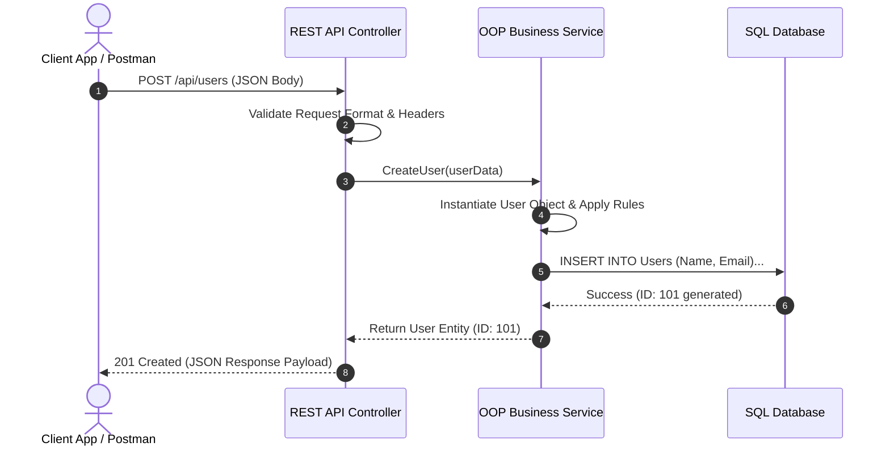
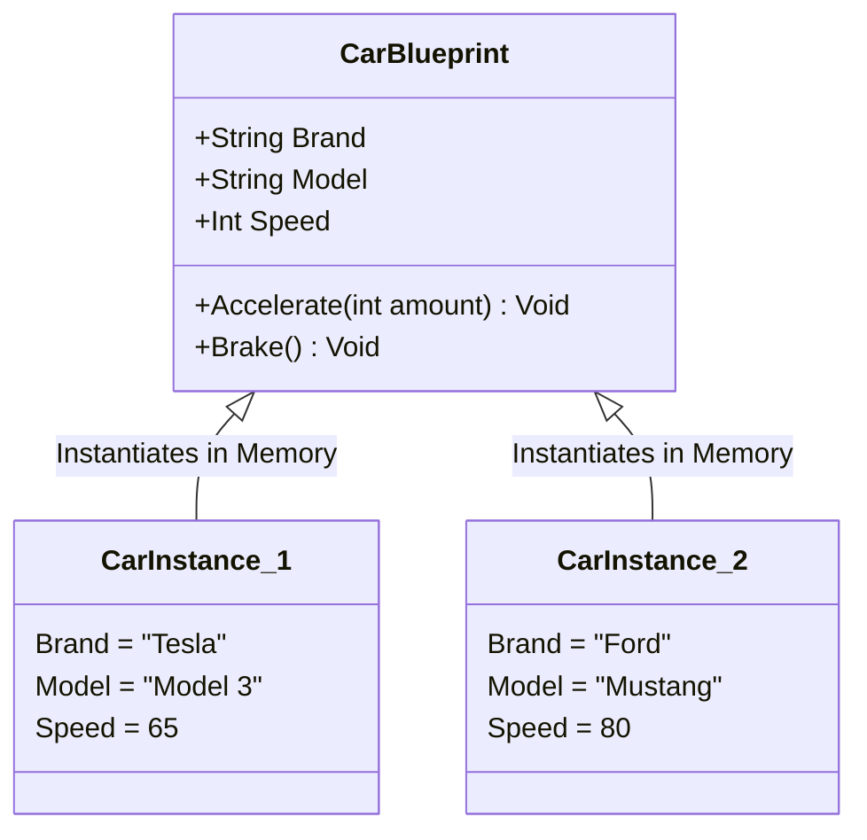
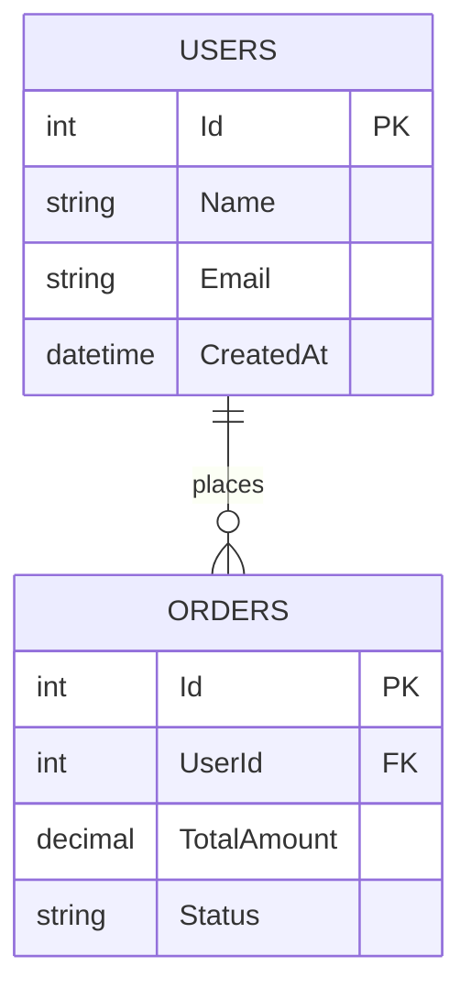

# Stage 0 — Architecture & Workflow Diagrams

Visual models depicting core concepts from Stage 0: REST API request execution, Git state transitions, Object-Oriented memory instantiation, and SQL Relational models.

---

## 1. REST API Request / Response Lifecycle

This diagram demonstrates how data moves between a client (Postman/Browser), an API server, and a relational database during HTTP requests.



---

## 2. Git State & Lifecycle Progression

This diagram illustrates how files move through Git environments from unstaged local edits to remote cloud repositories.

```mermaid
flowchart LR
    subgraph Local Workspace
        WD[Working Directory<br/><i>Unstaged Changes</i>]
        SA[Staging Area / Index<br/><i>Staged via 'git add'</i>]
        LR[Local Repository<br/><i>Committed via 'git commit'</i>]
    end

    subgraph Remote Host
        RR[Remote Repository<br/><i>GitHub / GitLab via 'git push'</i>]
    end

    WD -- "git add" --> SA
    SA -- "git commit" --> LR
    LR -- "git push" --> RR
    RR -- "git fetch / git pull" --> Local Workspace
```

---

## 3. OOP Class Blueprint vs. Instance Memory Model

This diagram highlights how a single class definition acts as a blueprint to spawn distinct object instances in system heap memory.



---

## 4. Database CRUD & Foreign Key Relationship Model

This entity-relationship structure shows how SQL tables enforce foreign key integrity and execute JOIN operations.


